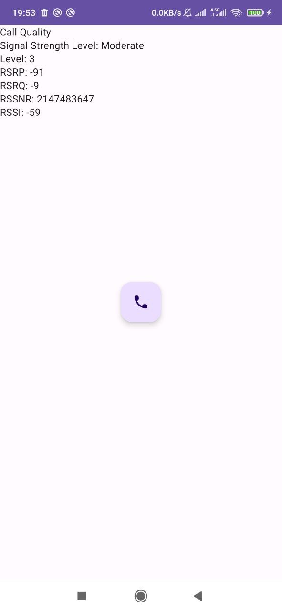
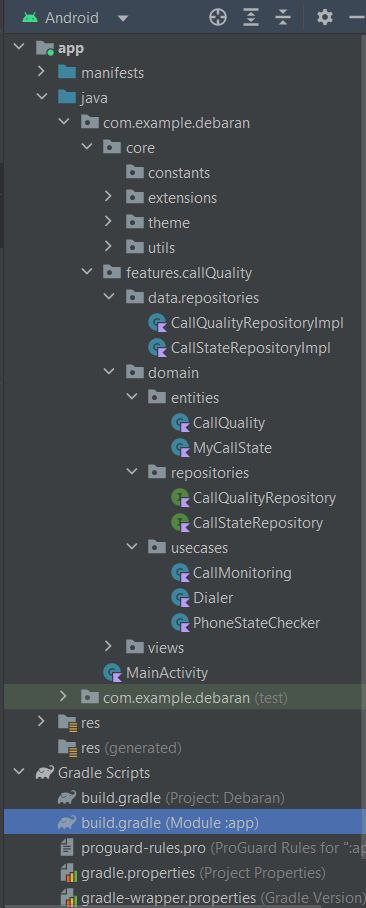
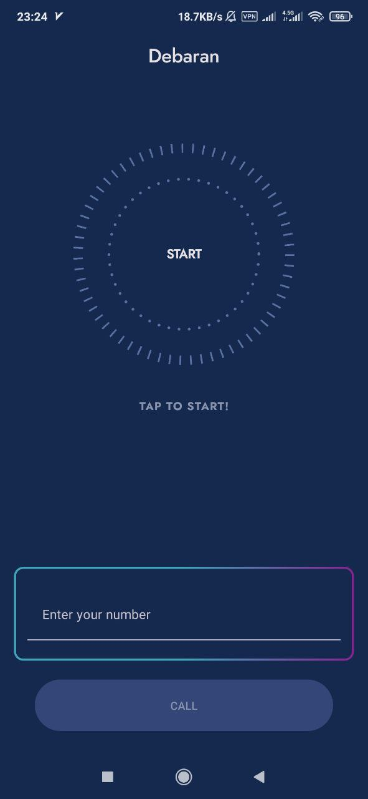
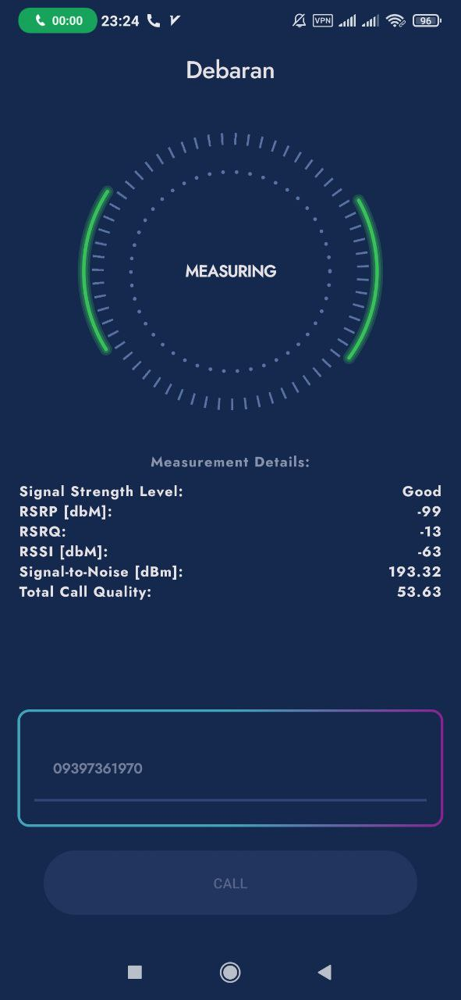

# PhoneCallQuality
An Android native application to check the incoming audio quality during a phone call for different technologies (4G, 5G)

Please check the provided report [PDF file](https://github.com/iliyami/PhoneCallQuality/blob/master/Debaran_Report.pdf) for more details.

### Project Description
This project focuses on examining and assessing the quality of voice transmission in telephone calls. It is not just an implementation project but also a research project.

The topic of call quality assessment is relatively new, and there are no similar software solutions available currently.

In the following sections, we will discuss the solutions, ideas, and implementation steps for this project. We will also provide an introduction to the project's subject matter.

### Familiarity with the Project Topic
In order to effectively understand and contribute to this project, it is important to have some familiarity with the subject matter.

# Phase 1: Research
In the first phase of this project, we began conducting research on the variables that play a role in call quality. Due to the abundance of variables in this field, a significant amount of time was spent identifying key variables.

The second phase of the research focused on setting up a development environment using the Kotlin language and learning the language itself. This phase also took some time due to its complexities.

During the research, we came across parameters such as POLQA and PESQ, which are not supported by dedicated libraries due to their high complexity.

We then came up with the creative idea of analyzing the quality of recorded parts of the call using third-party libraries. However, a significant obstacle arose when we discovered that in newer versions of Android, call recording functionality has been removed due to security features.

Following that, with the guidance of our course instructor and the assistance of esteemed instructors, we turned our attention to researching parameters that indirectly impact network quality.

After successfully implementing the project, a new phase began, driven by the challenges and results of our experiments. After each experiment, new concepts emerged in our minds that required further exploration and clarification through additional research.

# Phase 2: Initial Program Version
After several stages of experimentation, the initial version of the program was developed. At this stage, the requirements specified in the project were implemented.

In this version, the call quality is determined by the following parameters:

RSRP (Received Signal Reference Power): Received signal power from the source.
RSRQ (Reference Signal Received Quality): Quality of the received signal from the source.
RSSI (Received Signal Strength Indicator): Signal strength indicator.
SNR (Signal-to-Noise Ratio): Signal strength to noise signal ratio from the source.
Signal Strength Level: Normalized signal strength in four states (poor, moderate, good, unknown).
The Total Call Quality is calculated using a weighted qualitative formula, which is the result of extensive research and investigation. It has been implemented for both 4G and 5G generations, with the 5G portion being optional. The formulas are represented below:

Total Call Quality (4G) = RSRP * RSRQ + RSSI - SNR

Total Call Quality (5G) = RSRP * RSRQ + RSSI - SNR + Weighted Score (5G)

This initial program version incorporates the above parameters and formulas to determine the call quality.

# Phase 3: Improvements
After completing the previous phase, we decided to design a beautiful UI/UX for the program. The user interface design was not initially included as a project objective but was done as an optional addition.

Furthermore, all the code in this program has been developed following clean architecture principles and design patterns.

Additionally, the implementation of this program has been carried out for both 4G and 5G networks, ensuring compatibility with both generations.

# Final Words and Summary
List of Accomplishments:
• Conducted research on the given topic
• Gathered and compiled information
• Completed the project
• Implemented the project even for 5G technology (optional)
• Designed a simple and visually appealing user interface (optional)
• Commented the project code (optional)
• Utilized clean architecture principles (optional)
• Employed code design patterns (optional)

I would like to express my sincere thanks and appreciation to the esteemed instructor and all the respected course instructors for their guidance and time dedicated to this project.

I hope that this project can contribute to improving the quality of voice transmission in telephone calls and be utilized in the field of call quality assessment.

Thank you very much for your efforts in this project. If you have any questions or concerns, please feel free to reach out.